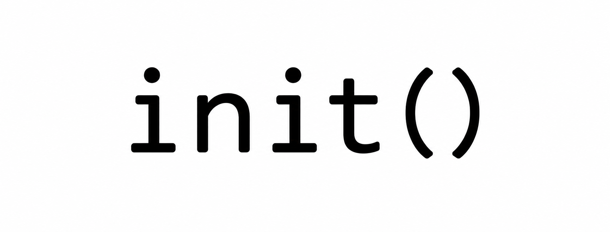
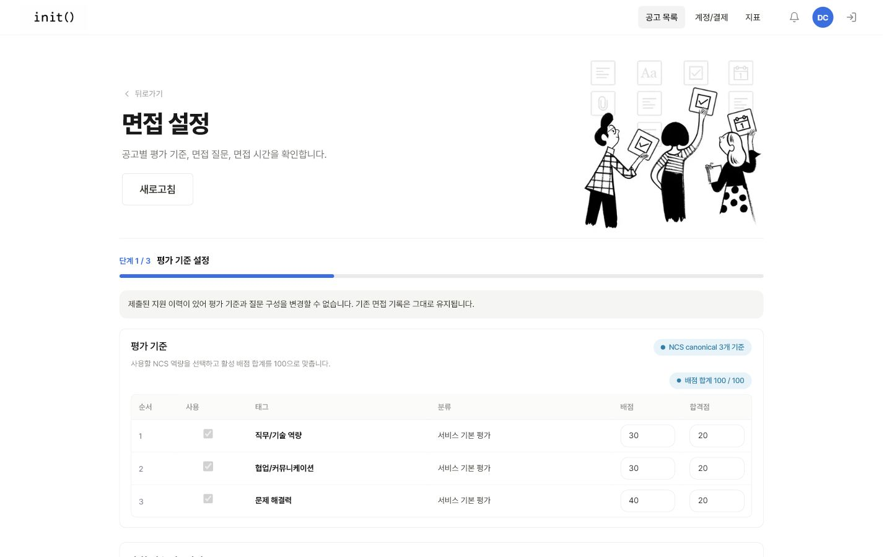
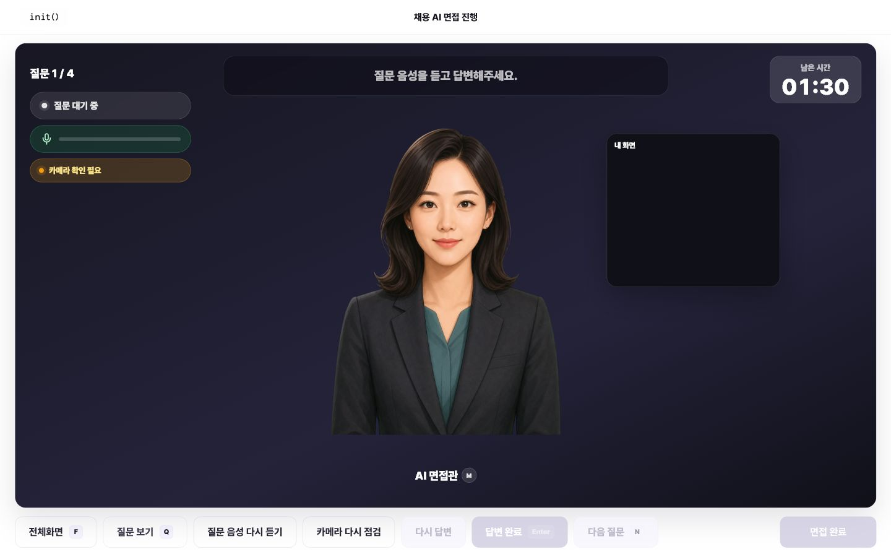
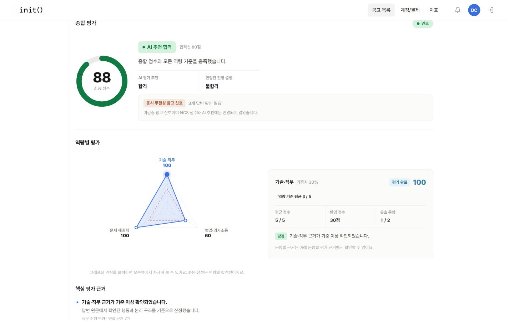
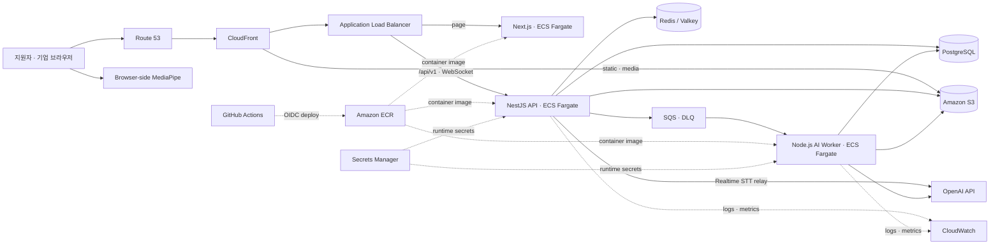
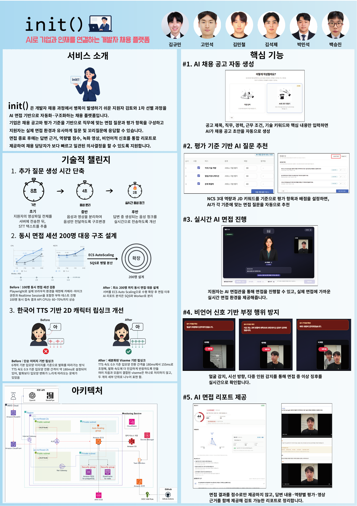

<p align="center">
  
</p>

<p align="center"><sub>INTERVIEW, CONNECTED.</sub></p>

<h1 align="center">채용 공고부터 AI 면접, 근거 기반 리포트까지</h1>

<p align="center">
  init()은 개발자·IT 직군의 채용 공고, 지원서, 면접 답변을 NCS 평가 기준과 검토 가능한 근거로 연결합니다.<br>
  반복적인 채용 운영은 줄이고, AI가 구조화한 결과를 바탕으로 사람이 최종 검토하고 확정할 수 있게 합니다.
</p>

<p align="center">
  <a href="https://github.com/seok3m4/init/actions/workflows/ci.yml?query=branch%3Adev"></a>
  
  
  
</p>

<p align="center">
  <a href="#product-tour">Product Tour</a> ·
  <a href="#key-engineering">Key Engineering</a> ·
  <a href="#system-architecture">Architecture</a> ·
  <a href="#project-poster">Poster</a> ·
  <a href="#quick-start">Quick Start</a>
</p>

<p align="center">
  
  
  
</p>

## 💡 Why init?

| 기존 채용 과정의 문제 | init()의 접근 |
| --- | --- |
| 지원자가 늘수록 검토와 1차 선별 시간이 함께 증가함 | AI 면접으로 1차 검토에 필요한 답변과 근거를 구조화 |
| 담당자마다 중요하게 보는 역량이 달라 평가가 흔들림 | NCS 3대 역량과 JD를 공통 평가 기준으로 연결 |
| 공고·지원서·면접 답변·평가 기준의 맥락이 분리됨 | 하나의 지원·면접 context로 연결 |
| 질문 생성·면접 진행·결과 정리에 반복 작업이 많음 | 비동기 AI pipeline으로 반복 작업 구조화 |
| 점수만 남고 어떤 답변이 근거였는지 추적하기 어려움 | 답변 ID와 evidence를 평가 결과에 연결 |

`채용 설계` → `지원 및 서류` → `AI 면접` → `평가 및 리포트`

채용 프로세스와 별도로 지원자는 직무·난이도·질문 유형을 선택해 모의면접을 수행하고, 강점·개선점·다음 연습 과제와 답변 근거·녹화 영상, 시선·고개 분석을 연습용 피드백으로 확인할 수 있습니다.

<a id="product-tour"></a>
## 🖥️ Product Tour

### 1. Design Interview

제목·직무·키워드와 선택 정보를 입력하면 AI가 가드레일을 거친 검토용 공고 초안을 만들며, 사용자가 적용한 뒤에만 `DRAFT`로 저장됩니다. 저장된 NCS 평가 기준과 공고 JD에 맞춰 생성·정렬 검증된 공통 질문 후보를 검토하고, NCS 가중치·합격점, 이력서 개인화 질문 정책, 준비·답변 시간을 사람이 확정합니다.


### 2. Run Interview

지원자는 실시간 STT와 질문 진행 상태를 확인하며 AI 면접을 수행합니다. 스트리밍 STT transcript를 바탕으로 답변 적응형 꼬리질문을 비동기 생성하고, 필요한 경우 원 질문 직후 한 번 삽입합니다. 실시간 transcript가 확보된 답변은 미디어 업로드 완료와 분리해 처리합니다.


### 3. Review Evidence

면접관은 역량별 점수와 연결된 답변 근거, 스크립트, 녹화 영상, 비언어 신호를 함께 검토한 뒤 최종 결과를 확정합니다. 비언어 신호는 응시 무결성을 위한 미검증 참고 정보이며 NCS 점수나 AI 추천에는 반영하지 않습니다.


<a id="key-engineering"></a>
## ⚙️ Key Engineering

### 중복 실행을 막는 비동기 AI 파이프라인

SQS 중복 전달과 worker 중단에 대비해 `processLogId`, DB lease, visibility heartbeat를 사용합니다.

[Deep Dive](#deep-dive-queue-reconciliation) · [PR #339](https://github.com/seok3m4/init/pull/339)

### 설명 가능한 평가와 사람의 최종 확정

불완전한 결과를 0점으로 바꾸지 않고 `NULL/RETRY`로 유지하며 점수와 답변 evidence를 연결합니다.

[PR #406](https://github.com/seok3m4/init/pull/406) · [PR #412](https://github.com/seok3m4/init/pull/412)

### 실시간 답변 처리와 미디어 업로드 분리

실시간 transcript가 확보된 답변은 상태 전이를 대용량 영상 업로드와 분리해 다음 질문 전환이 네트워크 속도에 묶이지 않게 했습니다.

[Deep Dive](#deep-dive-media-critical-path) · [PR #452](https://github.com/seok3m4/init/pull/452)

### 정확성과 응답성을 함께 지킨 대규모 조회

공통 where, 안정적인 tie-breaker, 경량 projection, summary API와 복합 인덱스를 적용했습니다.

[Deep Dive](#deep-dive-applicant-scale) · [PR #400](https://github.com/seok3m4/init/pull/400)

### 브라우저 실시간 면접의 신뢰 경계

MediaPipe 신호를 브라우저에서 수집하되 채점과 분리하고, 한국어 viseme timeline과 실제 오디오 RMS를 결합해 AI 면접관의 립싱크를 구동합니다.

[Deep Dive](#deep-dive-browser-runtime) · [commit e1f4a163](https://github.com/seok3m4/init/commit/e1f4a1634f3bcbf51a4791bdc538c9f10a116b43) · [commit a7d4abe8](https://github.com/seok3m4/init/commit/a7d4abe816d47cbfc3f9c2a2ba96b1fc05659bdf)

### OIDC 기반 AWS 배포와 운영 가시성

Route 53 → CloudFront → ALB → ECS 진입 경로와 ECR 배포, Secrets Manager 주입, CloudWatch dashboard·alarm을 Terraform과 GitHub Actions로 관리합니다.

[Architecture](#system-architecture) · [AWS runbook](./infra/aws/README.md)

<a id="system-architecture"></a>
## 🏗️ System Architecture

아래 다이어그램은 AWS 배포 경로입니다. 로컬에서는 frontend `3000`, API `3001`, Compose 기반 PostgreSQL·Redis·LocalStack을 사용합니다.



- MediaPipe는 worker가 아니라 브라우저에서 실행됩니다.
- Terraform은 2개 AZ에 걸친 public/private network와 ALB, ECS Fargate, RDS, Valkey, S3, SQS/DLQ를 관리합니다.
- 원본 파일은 S3에 저장하고 DB에는 `file_assets` 메타데이터를 저장합니다.
- 장기 AI 작업은 API 요청에서 직접 처리하지 않고 SQS와 worker로 분리합니다.
- GitHub Actions는 OIDC로 AWS 권한을 얻어 ECR image와 ECS task definition을 배포하며, 비밀값과 운영 경보는 Secrets Manager·CloudWatch로 분리합니다.

## 🔬 Technical Deep Dive

<a id="deep-dive-queue-reconciliation"></a>
### 1. DB와 Queue가 서로 다른 진실을 말하던 문제

**문제**

DB에는 `PENDING` 작업이 있지만 SQS publish가 유실될 수 있고, 반대로 큐에는 메시지가 남았지만 초기화로 process log와 application이 삭제될 수 있었습니다.

**설계 판단**

- 생성 후 15분이 지난 복구 가능 `PENDING`은 다음 recovery scan에서 같은 `processLogId`로 재발행합니다.
- scan은 최소 1분 간격으로만 시도되지만 순차 batch 처리 뒤 실행되므로 장시간 provider 호출 중에는 더 늦어질 수 있습니다.
- 대상은 `REPORT_GENERATE`, `GENERATING` batch가 연결된 `RESUME_QUESTION_GENERATE`, backoff가 지난 retryable `FAILED`처럼 repository 조건을 만족하는 작업으로 제한합니다.
- process log가 없는 메시지는 `MISSING`으로 보고 handler와 실패 callback 없이 ACK합니다.
- DB를 작업 생명주기의 source of truth로 선택했습니다.

**트레이드오프**

at-least-once 중복을 멱등성으로 흡수하는 대신 가장 이른 복구 시점은 생성 15분 후이며, 실제 탐지는 다음 scan과 진행 중 batch 시간의 영향을 받아 상한을 보장하지 않습니다. 주기 조회 비용이 생기고, 복구할 수 없는 stale message는 의도적으로 폐기합니다.

[PR #367 — 후속 publish 실패와 장기 PENDING 복구](https://github.com/seok3m4/init/pull/367) ·
[PR #419 — Orphan SQS 메시지의 DLQ 반복 전송 방지](https://github.com/seok3m4/init/pull/419) ·
[commit 58cf323f — RETRY·유실 job 복구](https://github.com/seok3m4/init/commit/58cf323fd792280b06927027d577e0e941c339d2)

<a id="deep-dive-media-critical-path"></a>
### 2. 영상 업로드가 면접 진행의 critical path였던 문제

**문제**

영상 업로드 완료를 기다리느라 답변 확정, STT 저장, 꼬리질문 요청과 다음 질문 전환이 모두 지연됐습니다.

**설계 판단**

- AudioWorklet에서 만든 음성 chunk를 WebSocket relay로 전송해, 녹화 영상 업로드를 기다리지 않고 실시간 transcript를 확보합니다.
- 실시간 transcript가 확보된 경로는 답변을 먼저 저장하고 미디어를 pending으로 연결한 뒤 upload queue에서 처리합니다.
- transcript가 없는 fallback 경로는 미디어 업로드 후 답변을 저장하고, 세션 종료 전에는 pending upload 완료를 기다립니다.
- 업로드 요청 멱등성과 pending/failed 상태를 별도로 관리합니다.
- 녹화 profile을 `1280×720`, `15fps`, 영상 `800kbps`, 음성 `48kbps`로 조정했습니다.

**측정 결과와 비용**

동일한 네트워크 throttling 조건에서 request 전송 시간이 `45.86초 → 11.22초`로 줄었습니다. `34.64초`, 약 `75.5%` 단축입니다. 실시간 transcript 경로에서는 답변과 미디어가 eventual consistency를 가지므로 pending과 failed 상태를 명시적으로 관리해야 합니다.

> 이 수치는 PR에 기록된 동일 조건 비교이며 전체 면접 완료 시간이나 운영 SLO가 아닙니다.

[Realtime STT relay source](./backend/api/src/modules/interview/realtime-stt-relay.server.ts) ·
[PR #452 — 미디어 업로드 병렬화 및 녹화 용량 최적화](https://github.com/seok3m4/init/pull/452)

<a id="deep-dive-applicant-scale"></a>
### 3. 5,000명 목록의 정확성과 응답성을 함께 지키기

**문제**

검색·필터·정렬·count가 다른 조건을 사용하고 상세 evidence와 미디어까지 목록에서 조회하면, 규모가 커질수록 결과 정합성과 응답성이 함께 흔들립니다.

**설계 판단**

- 목록과 count에 공통 where를 사용합니다.
- 모든 정렬에 `applicationId` tie-breaker를 둡니다.
- 상세 evidence, 답변, 미디어를 목록 projection에서 제외합니다.
- 공고 전체 KPI는 summary API로 분리합니다.
- PostgreSQL 복합 인덱스와 `EXPLAIN ANALYZE` 검증기를 추가했습니다.

**로컬 회귀 기준**

| 항목 | 결과 |
| --- | ---: |
| 활성 지원자 | 5,000명 |
| 측정 횟수 | 20회 |
| list + count p95 | 107.51ms |
| summary p95 | 130.46ms |
| 첫 / 중간 / 마지막 page query | 0.275 / 2.409 / 7.544ms |
| 전체 순회 | 5,000건 · unique 5,000건 |

> PostgreSQL 16 로컬 개발 장비의 회귀 비교 기준이며 운영 SLO가 아닙니다. offset pagination의 깊은 page 비용과 부분 문자열 검색 최적화는 남은 한계입니다.

[PR #400 — 대규모 지원자 목록·집계 안정화](https://github.com/seok3m4/init/pull/400) ·
[PR #409 — 대규모 지원자 규모 검증 자동화](https://github.com/seok3m4/init/pull/409)

<a id="deep-dive-browser-runtime"></a>
### 4. 브라우저 실시간 면접을 신뢰 경계 안에 두기

**문제**

얼굴·시선·다중 인원 감지와 AI 면접관 립싱크를 브라우저에서 실시간으로 처리해야 하지만, client가 만든 비언어 metadata를 채점 근거로 신뢰할 수는 없습니다.

**설계 판단**

- MediaPipe로 `FACE_MISSING`, `FACE_OUT_OF_FRAME`, `MULTIPLE_FACES`, `GAZE_AWAY` 같은 응시 무결성 신호를 브라우저에서 수집합니다.
- API는 허용 field, event 수, 값 범위와 payload 크기를 다시 검증하고 source를 `CLIENT_RUNTIME_UNVERIFIED`로 유지합니다.
- 비언어 신호는 NCS 점수와 AI 추천에서 제외하고 면접관이 보는 참고 정보로만 전달합니다.
- 립싱크는 한국어 음절을 초성·단모음/복합모음·종성 cue로 분해해 `rest`, `closed`, `open`, `wide`, `round`, `teeth` 6개 PNG 입 모양에 연결합니다.
- 실제 audio duration과 RMS를 우선하고, duration이 없는 browser fallback은 음절당 `155ms`, Realtime stream은 `180ms`를 사용하며 무음 구간에서는 timeline 진행을 멈춥니다.

**트레이드오프**

브라우저에서 즉시 피드백할 수 있지만 기기 성능과 카메라 환경에 영향을 받고, viseme은 음소 정렬 모델이 아닌 규칙 기반 근사입니다. 그래서 신호의 출처와 한계를 UI와 report contract에 남기고 채용 판정 입력에는 사용하지 않습니다.

[Nonverbal metadata contract](./backend/api/src/modules/interview/service/interview-nonverbal-metadata.ts) ·
[LipSyncDriver](./frontend/src/features/candidate-application-interview/LipSyncDriver.ts) ·
[commit e1f4a163 — 응시 무결성 리포트 연동](https://github.com/seok3m4/init/commit/e1f4a1634f3bcbf51a4791bdc538c9f10a116b43) ·
[commit a7d4abe8 — 한국어 PNG viseme](https://github.com/seok3m4/init/commit/a7d4abe816d47cbfc3f9c2a2ba96b1fc05659bdf)

## 🧰 Tech Stack

| 영역 | 기술 |
| --- | --- |
| Frontend | Next.js 16 · React 19 · TypeScript 5.9 · MediaPipe · Web Audio |
| Backend | NestJS 11 · Prisma 6 · JWT/OAuth · WebSocket |
| Data | PostgreSQL 16 · Redis/Valkey · Amazon S3 |
| Async & AI | Amazon SQS/DLQ · OpenAI Node SDK · Guardrail pipeline |
| Infra | Docker · Terraform · Route 53 · CloudFront/ALB · ECS/ECR · Secrets Manager · CloudWatch · GitHub Actions |

<a id="project-poster"></a>
## 📰 Project Poster

최종 발표 포스터에서 제품 흐름, 핵심 기능, 기술적 챌린지와 AWS 아키텍처를 한눈에 확인할 수 있습니다. 이미지를 클릭하면 원본 크기로 볼 수 있습니다.

[](./assets/readme/project-poster.png)

<a id="quick-start"></a>
## 🚀 Quick Start

### Prerequisites

- Node.js `20 LTS`
- npm `10 이상`
- Docker Desktop
- Git
- macOS/Linux: Bash `4 이상`
  - macOS 기본 `/bin/bash` 3.2는 로컬 실행 스크립트와 호환되지 않습니다.
  - Homebrew를 사용한다면 `brew install bash` 후 새 Bash가 `PATH`에서 먼저 선택되는지 `bash --version`으로 확인합니다.

### One-time setup

Windows:

```powershell
Copy-Item .env.example .env
docker compose -f infra/local/docker-compose.yml up -d

Push-Location backend/common
npm ci
npm run build
Pop-Location

foreach ($package in @("backend/api", "backend/worker", "frontend")) {
  Push-Location $package
  npm ci
  Pop-Location
}

.\server.ps1 prisma generate
.\server.ps1 prisma migrate
.\server.ps1 prisma seed
```

macOS/Linux (Bash 4+):

```bash
cp .env.example .env
docker compose -f infra/local/docker-compose.yml up -d

(cd backend/common && npm ci && npm run build)

for package in backend/api backend/worker frontend; do
  (cd "$package" && npm ci)
done

bash ./server prisma generate
bash ./server prisma migrate
bash ./server prisma seed
```

> `.env`의 예시 secret 값은 로컬 값으로 교체합니다. 실제 secret은 커밋하지 않습니다.

### Run locally

Windows:

```powershell
.\server.ps1 up all
```

macOS/Linux (Bash 4+):

```bash
bash ./server up all
```

| Service | URL |
| --- | --- |
| Frontend / Login | http://localhost:3000/login |
| API | http://localhost:3001 |
| Health | http://localhost:3001/api/v1/health |
| Swagger | http://localhost:3001/api-docs |
| Mailpit | http://localhost:8025 |
| LocalStack | http://localhost:14566 |

<details>
<summary><strong>개별 서비스 실행과 환경변수</strong></summary>

API, frontend, worker는 각각 **프로젝트 루트에서 연 별도 터미널**에서 실행합니다. 새 터미널은 다른 터미널의 process 환경을 상속하지 않으므로, 각 터미널에서 먼저 루트 `.env`를 로드합니다.

Windows에서 각 터미널에 환경변수 로드:

```powershell
Get-Content .env | ForEach-Object {
  if ($_ -and $_ -notmatch '^\s*#') {
    $name, $value = $_ -split '=', 2
    [Environment]::SetEnvironmentVariable($name, $value, 'Process')
  }
}
```

그 다음 각 터미널 중 하나에서 서비스 실행:

```powershell
# API terminal
cd backend/api
npm run dev
```

```powershell
# Frontend terminal
cd frontend
$env:NEXT_PUBLIC_API_BASE_URL = "http://localhost:3001"
npm run dev
```

```powershell
# Worker terminal
cd backend/worker
$env:WORKER_REPOSITORY_MODE = "prisma"
npm run start:dev
```

macOS/Linux도 각 터미널에서 `.env`를 다시 로드한 뒤 하나의 서비스만 실행합니다.

```bash
# API terminal
set -a
source .env
set +a
cd backend/api
npm run dev
```

```bash
# Frontend terminal
set -a
source .env
set +a
cd frontend
export NEXT_PUBLIC_API_BASE_URL="http://localhost:3001"
npm run dev
```

```bash
# Worker terminal
set -a
source .env
set +a
cd backend/worker
export WORKER_REPOSITORY_MODE="prisma"
npm run start:dev
```

Worker가 실행되지 않으면 AI 작업은 `PENDING`에서 진행되지 않습니다.

</details>

<details>
<summary><strong>로컬 인증과 Google OAuth</strong></summary>

1. `http://localhost:3000/login`에서 회원가입을 시작합니다.
2. 인증 메일은 실제 메일함이 아니라 Mailpit `http://localhost:8025`에서 확인합니다.
3. Google OAuth는 지원자 계정 전용입니다.
4. 실제 OAuth 검증에는 `.env`의 `GOOGLE_CLIENT_ID`, `GOOGLE_CLIENT_SECRET`, `GOOGLE_CALLBACK_URL`이 필요합니다.

</details>

<details>
<summary><strong>로컬 검증</strong></summary>

Windows:

```powershell
powershell -ExecutionPolicy Bypass -File scripts\check-local.ps1 -Role A
```

macOS/Linux:

```bash
bash scripts/check-local.sh -Role A
```

`A`는 담당 영역에 따라 `A`, `B`, `C`, `D`, `E`, `PM` 중 하나로 바꿉니다.

</details>

<details>
<summary><strong>Troubleshooting과 종료</strong></summary>

- Docker 오류: Docker Desktop 실행 후 `docker compose -f infra/local/docker-compose.yml up -d`
- DB env 오류: API·worker terminal에 루트 `.env`를 다시 로드
- 인증 메일 미수신: Mailpit과 Compose service 상태 확인
- Frontend API 오류: `http://localhost:3001/api/v1/health`와 `NEXT_PUBLIC_API_BASE_URL` 확인

서비스 종료:

Windows:

```powershell
.\server.ps1 down all
```

macOS/Linux (Bash 4+):

```bash
bash ./server down all
```

DB와 LocalStack volume까지 삭제:

```powershell
docker compose -f infra/local/docker-compose.yml down -v
```

> `down -v`는 PostgreSQL과 LocalStack 데이터를 삭제합니다. 필요한 데이터가 없을 때만 실행합니다.

</details>

## 🗂️ Repository Map

```text
init/
├─ frontend/         Next.js · React
├─ backend/
│  ├─ api/           NestJS · Prisma
│  ├─ worker/        SQS · OpenAI pipeline
│  └─ common/        DTO · enum · errors
├─ infra/            Docker · Terraform · AWS
├─ scripts/          local harness · smoke
├─ docs/             product → contracts → operations
└─ assets/           brand · README · presentation
```

## 📚 Documentation

| 문서 | 역할 |
| --- | --- |
| [`docs/01_product`](./docs/01_product) | 문제 정의, 기능 명세, 사용자 흐름 |
| [`docs/02_architecture`](./docs/02_architecture) | 시스템 경계, 데이터 모델, 비동기 pipeline |
| [`docs/03_contracts`](./docs/03_contracts) | REST API, enum, error, 상태 전이 |
| [`docs/04_implementation`](./docs/04_implementation) | 분업, 테스트, 배포, 운영 runbook |
| [`docs/05_agents`](./docs/05_agents) | 영역별 ownership과 협업 규칙 |

## 👥 Team

김규민 · 고민석 · 김민철 · 김석제 · 박민석 · 백승진

---

<p align="center"><sub>INTERVIEW, CONNECTED. · init()</sub></p>
