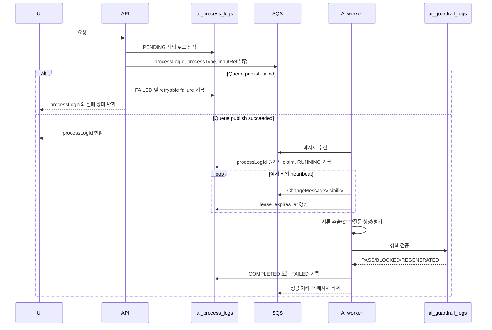
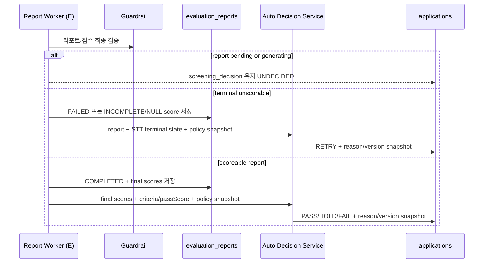
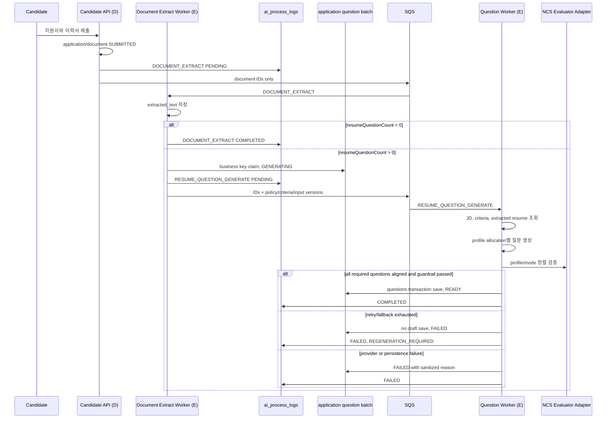

# Async AI Pipeline

> Source: `init/docs/00_source` 기준. Generated at 2026-06-27.

AI 처리와 비동기 작업의 실행 흐름을 정리한다.

## Pipeline Principles

- 장기 작업은 `ai_process_logs`에 작업 유형, 상태, 입력 참조, 출력 참조를 기록한다.
- AI 결과 저장 전 guardrail 정책 위반 여부를 검증하고 `ai_guardrail_logs`에 PASS/BLOCKED/REGENERATED를 기록한다.
- 실패한 작업은 `FAILED` 상태와 재시도 가능 사유를 화면에 노출한다.
- `failure.retryable=true`는 사용자에게 새 job 시작을 허용할 수 있음을 의미할 뿐, queue 자동 retry/redelivery를 뜻하지 않는다. `REGENERATION_REQUIRED` 실패는 최종 `FAILED`를 기록하고 메시지를 ACK한다.
- 임베딩은 원문 해시(`source_text_hash`)로 중복 생성을 방지하고, `ai_guardrail_logs`에 PASS를 기록한 뒤 저장한다. `ai_process_logs.outputRef`에는 원문 대신 `sourceTextHash`, `dedupeKey`, `duplicatePolicy=UPSERT_BY_SOURCE_TEXT_HASH`만 남긴다.
- AWS 실배포 worker queue는 SQS Standard를 기준으로 한다. Redis는 인증 TTL/cache 용도이며, AI worker queue backend로 전환하지 않는다.
- SQS Standard는 중복 전달이 가능하므로 worker는 `processLogId`를 idempotency key로 사용한다. 이미 `COMPLETED`인 작업 재전달은 AI provider 호출 없이 ack하고, 처리 중인 작업은 `lease_owner`, `lease_expires_at` 조건부 갱신으로 원자적 claim을 획득한 worker만 실행한다.
- 장기 AI 작업은 주기적으로 `ChangeMessageVisibility`와 DB lease 갱신을 함께 수행한다. heartbeat 실패 또는 lease 상실 시 guardrail·최종 저장을 진행하지 않고 메시지를 재전달 가능 상태로 남긴다.
- NCS 이력서 질문 생성의 logical model과 개인정보 경계는 [ncs-recruiting-question-generation.md](./ncs-recruiting-question-generation.md)를 따른다.

## Main Flows



### Automatic Screening Decision Flow

자동 판정은 AI provider 출력이 아니라 guardrail을 통과해 저장된 리포트, 점수와 공고별 policy snapshot을 입력으로 사용하는 deterministic 단계다.



- `PASS/HOLD/FAIL`은 guardrail 이후 저장된 유효 점수가 있을 때만 결정한다.
- report 생성 중에는 `UNDECIDED`를 유지한다.
- report terminal 실패, STT terminal 인식 불가, 평가 불완전 또는 필수 점수 NULL은 `RETRY`이며 0점/FAIL로 변환하지 않는다.
- 자동 판정 저장은 `reportId + policyVersion + criteriaVersion + decisionPolicyVersion`을 멱등 key로 사용한다.
- 자동 판정 규칙은 [`automatic-screening-decision.md`](../03_contracts/automatic-screening-decision.md)를 따른다.
- RETRY job 생성, backoff와 한도는 #397에서 별도로 확정한다.

### RETRY Processing Flow

- `RETRYABLE | STT_RETRYABLE`은 최초 실행을 포함해 총 3회까지 같은 `processLogId`를 SQS redelivery로 처리한다.
- retryable 실패 시 worker는 현재 메시지 visibility를 실패 시점부터 900초로 재설정하고 `attempt_count`, `next_retry_at`을 갱신한다. 실행 중 heartbeat는 300초다.
- 3번째 실패는 `RETRY_EXHAUSTED`, `next_retry_at=NULL`로 기록하고 ACK한다. 운영자는 API-100으로 REPORT 재처리를 명시적으로 시작할 수 있다.
- ADMIN 재처리는 새 process log를 만들며 `retry_source=OPERATOR`, `retry_of_process_log_id`로 이전 실행을 연결한다.
- application별 활성 `REPORT_GENERATE(PENDING | RUNNING | 자동 재시도 backoff 중 FAILED)`은 하나만 허용한다. 중복 요청은 기존 process를 반환하고 큐에 중복 발행하지 않는다.
- DB commit과 queue publish 사이에서 중단된 `REPORT_GENERATE/PENDING`과 queue message 유실 가능성이 있는 due `REPORT_GENERATE | RESUME_QUESTION_GENERATE/FAILED` 자동 재시도는 동일 process envelope를 복구 발행한다. 중복 delivery는 worker claim으로 멱등 처리하며, `FAILED`는 저장된 `next_retry_at` 이후에만 재claim하고 실제 provider 실행 시 저장 attempt를 1씩 단조 증가시킨다. backoff 중 일찍 도착한 메시지는 삭제하지 않고 남은 시간만큼 visibility를 연장하며 attempt를 소비하지 않는다. 새 recovery message의 SQS receive count가 1부터 시작하거나 조기 delivery로 증가해도 backoff와 총 3회 한도를 초기화하거나 앞당기지 않는다.
- `REANSWER_REQUIRED`는 지원자 재답변 1회 경로로만 처리하며 queue attempt와 분리한다.
- 재처리 성공 시 기존 REPORT final save와 `AUTO_SCREENING_DECISION_V1` engine을 그대로 실행한다.

### Resume Personalized Question Flow



Trigger와 저장 책임:

- D는 지원 완료와 document 연결을 소유한다.
- E document worker는 `EXTRACTED` 전이 후 정책을 조회해 개인화 질문 job 생성 조건을 평가한다.
- E question worker는 batch claim, 생성, NCS 정렬 검증, guardrail, batch/question 최종 저장을 소유한다.
- C는 API-098로 상태·결과를 조회하고 API-099로 명시적 재시도만 요청한다.
- D는 `READY` batch만 세션 질문 snapshot으로 소비한다.

### RESUME_QUESTION_GENERATE Job Contract

SQS message와 `ai_process_logs.input_ref`에는 아래 참조값만 넣는다.

```json
{
  "processLogId": 0,
  "processType": "RESUME_QUESTION_GENERATE",
  "applicationId": 0,
  "postingId": 0,
  "documentId": 0,
  "policyVersion": 0,
  "criteriaVersion": 0,
  "inputVersion": "opaque-version",
  "resumeDocumentHash": "one-way-hash"
}
```

`NCS_ACTIVE_PROFILE_V2`부터 message/input metadata에 `usageScope: STANDARD | DEMO_PRESET`을 포함한다. 기존 message의 생략값은 STANDARD다. business key는 `applicationId + usageScope + policyVersion + criteriaVersion + jdSnapshotHash + resumeDocumentHash`이며 STANDARD와 DEMO_PRESET batch는 서로의 status/stale/retry를 변경하지 않는다.

DEMO_PRESET 개인화 작업은 STANDARD `resumeQuestionCount`와 별개인 추가 BASE 1개를 만든다. 지원 완료와 서류 추출 완료 뒤 사전 생성하며, 버튼 클릭이나 session start에서 새 AI job을 만들지 않는다. 결과는 `JOB_TECHNICAL + PROBLEM_SOLVING` 두 binding과 factual anchor를 가져야 한다. anchor가 없으면 demo readiness만 UNAVAILABLE로 투영하고 STANDARD 작업은 실패시키지 않는다.

공식 DEMO_PRESET follow-up은 공통 질문에는 생성하지 않고 개인화 BASE에만 정확히 한 번 결정한다. 첫 provider 실패는 한 번 재시도하고, 재실패하면 답변을 근거로 한 안전 fallback을 사용한다. 원본 두 binding, question mode, answer time과 `usageScope=DEMO_PRESET`을 session private question에 상속한다.

발표 전용 `SALTLUX_AI_BACKEND_V1` fixture는 예외적으로 외부 question/report provider를 호출하지 않는다. API가 정확한 회사명·공고명·`sessionMode=DEMO_PRESET` 조합을 확인해 marker와 고정 꼬리질문을 server-side payload에만 추가하고, worker는 버전 관리된 고정 산출물을 실제 session/answer/criterion ID에 연결해 일반 `evaluation_reports`, `report_scores`, `ncs_answer_evaluations` 저장 경로로 기록한다. `ai_process_logs.output_ref`에는 `providerMode=fixed`, `model=fixed-demo-fixture-v1`을 남긴다. SQS delivery, claim, guardrail, 최종 저장과 멱등성은 일반 REPORT_GENERATE와 동일하게 유지한다.

private follow-up 답변의 부모 관계는 질문 문구가 아니라 저장 ID를 정본으로 사용한다. `follow_up_questions.answer_id`는 원본 BASE 답변, `follow_up_questions.inserted_session_question_id`는 꼬리답변의 `interview_answers.session_question_id`와 연결된다. REPORT_GENERATE는 모든 세션 답변의 STT가 transcript 저장 또는 `STT_UNAVAILABLE` terminal 상태에 도달한 뒤에만 발행한다. 최신 STT process의 `FAILED + REANSWER_REQUIRED`와 인식 불가로 분류된 `FAILED + NON_RETRYABLE`을 terminal로 취급하며, 이전 실패 뒤 더 최신 PENDING/RUNNING 재시도가 있으면 계속 대기한다. 연결·provider 장애가 총 3회 소진된 `RETRY_EXHAUSTED`는 인식 불가가 아니라 운영 확인 대상이므로 지원자 재답변 상태로 변환하지 않는다.

- 이력서 원문, 추출 텍스트, 질문 결과는 message에 넣지 않는다.
- worker는 `applicationId`와 `documentId`의 소유 관계를 재검증한 뒤 repository에서 입력을 읽는다.
- SQS delivery 멱등 key는 `processLogId`, business 멱등 key는 `applicationId + usageScope + policyVersion + criteriaVersion + jdSnapshotHash + resumeDocumentHash`다. legacy input의 usage scope는 STANDARD다.
- 동일 business key의 `GENERATING`, `READY`, `REVIEW_REQUIRED` batch가 있으면 새 batch를 만들지 않는다. `FAILED`는 API-099의 명시적 retry로만 새 process log를 연결한다.
- document worker는 추출 결과 저장 뒤 생성한 후속 job을 SQS에 발행한다. 후속 발행이 실패하면 해당 child `ai_process_logs`와 연결 batch만 `FAILED`로 보상하고, 이미 `EXTRACTED`로 저장한 문서 상태는 되돌리지 않는다.
- worker는 `RESUME_QUESTION_GENERATE/PENDING + 연결 batch GENERATING`, `REPORT_GENERATE/PENDING` 또는 `next_retry_at`이 지난 `REPORT_GENERATE | RESUME_QUESTION_GENERATE/FAILED + RETRYABLE | STT_RETRYABLE`을 큐 미발행·유실 복구 대상으로 간주한다. 동일 `processLogId`, `processType`, `inputRef`, `attempt` envelope를 재발행하며 worker claim이 중복 delivery를 멱등 처리한다. 복구 조회나 개별 발행 실패는 기록하되 다른 복구 작업과 일반 queue 소비를 중단하지 않는다.
- worker ECS task role은 AI job queue를 소비하는 권한과 함께 후속·복구 job 발행에 필요한 `sqs:SendMessage`를 같은 queue ARN 범위로 가져야 한다.
- 각 질문 생성 호출은 활성 profile별 남은 슬롯보다 후보를 1개 더 요청하고 품질·중복·정렬 검증을 통과한 후보만 요청 개수까지 채택한다.
- 정렬 실패는 같은 mode로 최초 생성 후 최대 2회 재생성하고 계약에 허용된 단방향 fallback만 한 번 사용한다.
- 요청 개수보다 적은 질문을 `READY`로 저장하지 않는다. fallback까지 소진해 정확한 `ALIGNED` 세트를 만들지 못하면 draft를 저장하지 않고 process와 연결 batch를 `FAILED/REGENERATION_REQUIRED`로 기록한다.
- `REGENERATION_REQUIRED`는 상태 응답에서 `failure.retryable=true`지만 사용자가 새 job을 요청할 수 있다는 뜻이다. 현재 SQS 메시지는 ACK하며 큐 자동 재시도·재전달 대상이 아니다.

## Async Endpoint Map

| API ID | Method | Path | Purpose | Related Tables |
| --- |--- |--- |--- |--- |
| API-028 | POST | /reports/{reportId}/evaluation-context | 평가 컨텍스트 구성 | companies, candidate_profiles, postings, criterion_tags, evaluation_criteria, applications, application_documents, interview_answers, evaluation_reports, report_scores, report_evidences, manual_evaluations, ai_process_logs |
| API-029 | POST | /reports/{reportId}/answer-evaluation | 답변 채점 및 근거 생성 | companies, candidate_profiles, postings, criterion_tags, evaluation_criteria, applications, interview_sessions, interview_session_questions, interview_answers, evaluation_reports, ncs_answer_evaluations, report_scores, report_evidences, manual_evaluations, ai_process_logs |
| API-030 | POST | /reports/{reportId}/communication-analysis | 비언어/음성 지표 보조 분석 | companies, candidate_profiles, file_assets, postings, applications, consent_records, evaluation_reports, report_scores, report_evidences, ai_process_logs |
| API-031 | POST | /reports/{reportId}/generate | 리포트 생성 | companies, candidate_profiles, postings, criterion_tags, evaluation_criteria, applications, application_documents, interview_sessions, interview_session_questions, interview_answers, evaluation_reports, ncs_answer_evaluations, report_scores, report_evidences, ai_process_logs |
| API-038 | POST | /company/interviews/questions/generate | 저장된 평가 기준 기반 공통 질문 추천 | companies, postings, criterion_tags, evaluation_criteria, question_bank, applications, interview_sessions, manual_evaluations, ai_process_logs |
| API-085 | POST | /company/recruitments/ai-draft | 공고 생성 AI 초안 작성 | companies, postings, ai_process_logs, ai_guardrail_logs |
| API-045 | POST | /candidate/mock-interviews/questions/generate | 연습용 질문 목록 구성 | candidate_profiles, question_bank, interview_sessions, ai_process_logs |
| API-050 | POST | /candidate/mock-interviews/{sessionId}/stt | STT 처리 | candidate_profiles, file_assets, applications, interview_sessions, interview_answers, evaluation_reports, report_scores, report_evidences, ai_process_logs |
| API-051 | POST | /candidate/mock-interviews/{sessionId}/follow-up-question | 꼬리질문 생성 | candidate_profiles, postings, question_bank, applications, interview_sessions, interview_answers, follow_up_questions, ai_process_logs |
| API-057 | POST | /candidate/mock-interview/reports/{reportId}/generate | 피드백 리포트 생성 | candidate_profiles, postings, criterion_tags, evaluation_criteria, question_bank, applications, interview_sessions, interview_answers, evaluation_reports, report_scores, report_evidences, manual_evaluations, ai_process_logs |
| API-070 | POST | /candidate/interviews/{sessionId}/stt | STT 처리 | companies, candidate_profiles, file_assets, postings, applications, interview_sessions, interview_answers, ai_process_logs |
| API-071 | POST | /candidate/interviews/{sessionId}/follow-up-question | 꼬리질문 생성 | candidate_profiles, postings, question_bank, applications, application_documents, interview_sessions, interview_answers, follow_up_questions, ai_process_logs |
| API-076 | POST | /candidate/documents/extract | 서류 텍스트 추출 | candidate_profiles, file_assets, applications, application_documents, manual_evaluations, ai_process_logs |
| API-099 | POST | /company/interviews/applications/{applicationId}/resume-questions/retry | 실패·검토 필요 이력서 질문 재생성 | applications, application_documents, application_interview_question_batches, application_interview_questions, ai_process_logs |
| API-079 | POST | /ai/guardrails/validate | AI 출력 안전성 검증 | evaluation_reports, report_scores, report_evidences, manual_evaluations, ai_process_logs, ai_guardrail_logs |
| API-080 | GET | /ai/jobs/{processLogId}/status | AI 작업 상태 조회 | ai_process_logs, ai_guardrail_logs |

## CandidateProfileAiContextV1

API-045, API-051, API-071은 클라이언트 입력이 아니라 인증된 `candidateId`로 안전한 프로필 컨텍스트를 구성한다. 컨텍스트에는 summary, 최대 3,000자의 coverLetter, GitHub/블로그/포트폴리오 URL, 학력·경력·활동·자격 항목을 포함하고 이름·이메일·전화번호·DB ID는 제외한다. API-045에서 세트를 선택하면 최신 프로필 대신 세트의 고정 스냅샷을 사용한다. 꼬리질문에서는 답변/JD/서류가 주 근거이고 프로필은 보조 근거다.

API-045 결과는 프론트가 최대 약 15초 동안 API-080으로 조회한다. 완료 결과의 `processLogId`를 API-044에 전달하면 서버가 소유권·설정·단일 사용 여부를 검증한 뒤 세션 질문과 이용권을 한 트랜잭션에서 확정한다. 실패·시간초과·부족한 결과는 질문 유형별 안전한 기본 질문으로 보완하며 모의면접 질문은 `question_bank`에 저장하지 않는다.

원문 컨텍스트는 SQS 메시지에서만 사용한다. `ai_process_logs.input_ref`에는 schemaVersion, 섹션별 개수, 문자 수, SHA-256 해시, `profileUpdatedAt`만 남긴다. 질문 출력은 나이·성별·주소·장애/건강·연봉·학교/회사 명성을 추론하거나 평가해서는 안 되며, 이메일·전화번호·URL이 포함된 출력은 가드레일에서 차단하고 최종 저장하지 않는다.

## Status And Guardrail Contracts

- 장기 작업 생성 API는 `202 Accepted`와 `processLogId`를 반환한다.
- 화면은 `GET /ai/jobs/{processLogId}/status`로 `PENDING`, `RUNNING`, `COMPLETED`, `FAILED` 상태와 `output`, `failure`를 조회한다.
- 상태 조회는 `inputRef.requestedBy`와 현재 로그인 사용자를 비교한다. ADMIN은 운영 조회를 허용하고, COMPANY job은 `userId`와 `companyId`, CANDIDATE job은 `userId`와 `candidateId`가 모두 일치해야 한다.
- 사용자 화면은 AI 상태를 한글로 표시한다. `PENDING=대기 중`, `RUNNING=처리 중`, `COMPLETED=완료`, `FAILED=실패`를 기본 라벨로 사용한다.
- `FAILED` 상태는 `failure.category`, `failure.reason`, `failure.retryable`을 포함한다.
- worker의 `finalSave`는 guardrail `PASS` 또는 `REGENERATED` 이후에만 실행된다.
- `BLOCKED` 결과는 최종 저장 없이 `ai_guardrail_logs`와 `ai_process_logs.status=FAILED`로 기록한다.
- B의 공고 초안 `postingDraft`는 사용자 검토 전 저장하지 않는다. C의 JD 질문 `questionCandidates`는 guardrail과 NCS 정렬 검증을 모두 통과한 항목만 공통 질문 목록에 저장하고, 사용자가 Drawer에서 수정·삭제한 뒤 다음 단계 이동 시 현재 목록을 활성 질문 세트로 확정한다.
