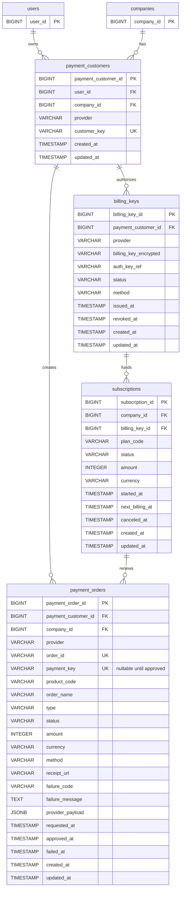

# Payment ERD Addendum

Status: implementation-ready draft  
Date: 2026-07-03  
Scope: Toss one-time payment now, subscription-ready structure later

This ERD addendum is intentionally separate from the main generated ERD files.
When implementation starts, the same structure should be reflected in Prisma,
runtime migrations, and the main data-model documentation.

## Phase Policy

- Phase 1 creates only the tables needed for one-time payments:
  `payment_customers` and `payment_orders`.
- Phase 2 can add automatic billing without changing Phase 1 table ownership:
  `billing_keys` and `subscriptions`.
- Raw Toss responses may be stored for debugging and reconciliation, but secret
  keys, full card numbers, and sensitive payment method details are never stored.

## Target Mermaid Diagram

The diagram shows the target structure after Phase 2. Phase 1 implements only
`payment_customers` and `payment_orders`; subscription relationships become
active when `billing_keys` and `subscriptions` are added.

## Phase 1 Tables

### payment_customers

Maps an application company user to a Toss `customerKey`.

| Column | Type | Rule |
| --- | --- | --- |
| `payment_customer_id` | BIGINT PK | Internal identity |
| `user_id` | BIGINT FK | `users.user_id`, company account owner |
| `company_id` | BIGINT FK | `companies.company_id` |
| `provider` | VARCHAR(30) | `TOSS` |
| `customer_key` | VARCHAR(100) UNIQUE | Stable Toss customer key, e.g. `company_1` |
| `created_at` | TIMESTAMP | Created time |
| `updated_at` | TIMESTAMP | Updated time |

### payment_orders

Stores checkout orders and Toss approval results.

| Column | Type | Rule |
| --- | --- | --- |
| `payment_order_id` | BIGINT PK | Internal identity |
| `payment_customer_id` | BIGINT FK | `payment_customers.payment_customer_id` |
| `company_id` | BIGINT FK | Denormalized owner check and query filter |
| `provider` | VARCHAR(30) | `TOSS` |
| `order_id` | VARCHAR(100) UNIQUE | Toss order id generated by server |
| `payment_key` | VARCHAR(200) UNIQUE nullable | Filled after Toss success redirect or confirm |
| `product_code` | VARCHAR(50) | Server-side product catalog key |
| `order_name` | VARCHAR(150) | User-visible order name |
| `type` | VARCHAR(30) | `ONE_TIME`, later subscription order types |
| `status` | VARCHAR(30) | Payment status enum |
| `amount` | INTEGER | KRW won amount |
| `currency` | VARCHAR(3) | `KRW` |
| `method` | VARCHAR(30) nullable | Toss payment method after approval |
| `receipt_url` | TEXT nullable | Toss receipt URL |
| `failure_code` | VARCHAR(100) nullable | Toss or local failure code |
| `failure_message` | TEXT nullable | Safe user/debug failure message |
| `provider_payload` | JSONB nullable | Sanitized Toss response payload |
| `requested_at` | TIMESTAMP nullable | Confirm request start |
| `approved_at` | TIMESTAMP nullable | Toss approval time |
| `failed_at` | TIMESTAMP nullable | Failure time |
| `created_at` | TIMESTAMP | Created time |
| `updated_at` | TIMESTAMP | Updated time |

## Phase 2 Tables

### billing_keys

Stores encrypted billing keys issued by Toss after customer authorization.

### subscriptions

Stores plan state and next billing schedule. Renewal charges create
`payment_orders` with `type = SUBSCRIPTION_RENEWAL`. Phase 2 also adds a
nullable `subscription_id` relationship to `payment_orders` for renewal orders.

## Indexes And Constraints

| Table | Constraint |
| --- | --- |
| `payment_customers` | UNIQUE (`provider`, `customer_key`) |
| `payment_customers` | UNIQUE (`provider`, `company_id`) |
| `payment_orders` | UNIQUE (`provider`, `order_id`) |
| `payment_orders` | UNIQUE (`provider`, `payment_key`) where `payment_key` is not null |
| `payment_orders` | INDEX (`company_id`, `created_at`) |
| `payment_orders` | INDEX (`status`, `created_at`) |
